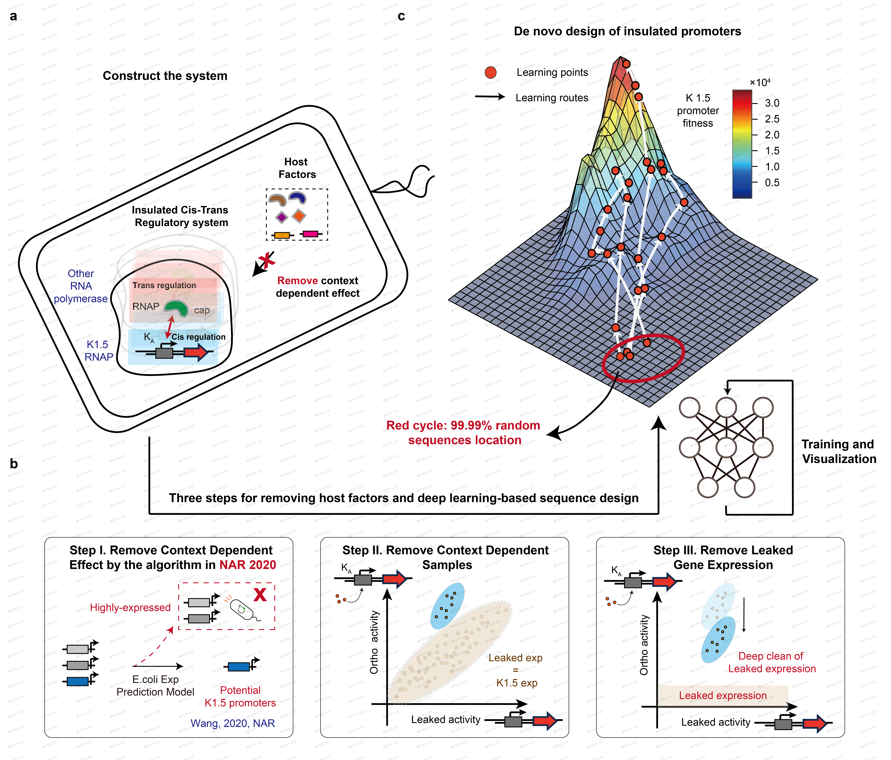

# DeepInsulated: De novo design of insulated cis-regulatory elements based on deep learning-predicted fitness landscape #
The code for official implementation of "De novo design of insulated cis-regulatory elements based
on deep learning-predicted fitness landscape"

This codebase provides:
1. The implementation of prediction model of insulated dataset.
2. The implementation of de novo design of insulated promoters.
3. The implementation of sequence space visualization and kernel visualization.

## Contents
1. [Introduction](#introduction)
2. [Environment Setup](#environment-setup)
3. [Design Promoter Sequence](#design-promoter-sequence)
4. [Bibtex](#bibtex)

## Introduction <a name="introduction">
Precise control of gene activity is crucial in bioengineering applications. Despite tremendous efforts in _cis_-regulatory sequence activity prediction and reverse engineering, the host cellular context-dependent effects have long been neglected, leading to persistent difficulties in accurately modeling the regulatory process. Here, we introduce an insulated design strategy for purifying and modeling host-independent transcriptional activity. By incorporating heterologous paired _cis_- and _trans_-regulatory modules into an orthogonal host cell, we have created a controllable transcriptional regulatory system. A deep learning-based algorithm combined with experimental data purification process enabled us to _de novo_ design full-length transcriptional promoter sequences based on host-independent activity landscape. 

<div align='center'><br></div>

Remarkably, the landscape accurately depicted the transcriptional activity of the insulated system, which can generate desired sequence- and function-diversified _cis-_regulatory sequences for three different _trans_-RNA polymerase, and their activities are precisely predictable in both bacterial (_Escherichia Coli_) and mammalian (_Chinese hamster ovary_) cell lines. We expected that generative design strategy could be expanded to other complex _cis_-regulatory elements by combining the deep learning-based algorithm and construction of paired _cis_- and _trans_-regulatory modules in an orthogonal host cell.


## Environment Setup <a name="environment-setup">
**Env Requirements:** 
- MAC OS, Linux or Windows.
- Python 3.6.
- Tensorflow 1.10.0 + keras 2.1.0
- CUDA 9.0  if you need train deep learning model with gpu.

**Steps of using DeepInsulated:** 

0. Install Python ref to [Download Python](https://www.python.org/downloads/)

1. Install the code in virtualenv to keep your environment clean:

    ##### on macOS/Linux
    ```
    pip install virtualenv  
    # or 
    pip install -i https://pypi.tuna.tsinghua.edu.cn/simple virtualenv 

    virtualenv --python=python3 Deepinsulated
    cd Deepinsulated
    source ./bin/activate
    ```
    Optional: After use, shutdown virtual environment with
    ```
    deactivate
    ```

    ##### on Windows (open cmd with administrator's permission)
    ```
    pip install virtualenv  
    # or 
    pip install -i https://pypi.tuna.tsinghua.edu.cn/simple virtualenv 
    virtualenv --python=python3 Deepinsulated
    cd Deepinsulated
    .\Scripts\activate.bat
    ```
    Optional: Shutdown virtual environment with
    ```
    .\Scripts\deactivate.bat
    ```

2. Install [Git](https://git-scm.com/), this step is optional if you does not install DeepInsulated by git clone. Clone the source codes with git. 
    ```
    git clone https://github.com/HaochenW/deepinsulated.git
    ```
3. or, download the source codes and extract files and put it in the virtual environment directory you defined. 

4. after 2/3, the directory of DeepInsulated should have the following structure:
    
    ```
    DeepInsulated
        deepinsulated
            |-------
            |
            |-------data
                    |...
            |-------prediction
                    |...
            |-------design
                    |...
            |-------visualize
                    |...
            |-------weight
                    |...
            |-------
            |...
        |...
    ```

5. After the extraction, download all dependencies with the following commend.
    ```
    cd deepinsulated
    pip install -r requirements.txt
    ```
    To boost download speeds, you could setup pip mirror such as
    ```
    pip install -i https://pypi.tuna.tsinghua.edu.cn/simple -r requirements.txt  
    # or
    pip install -i https://mirrors.aliyun.com/pypi/simple  -r requirements.txt
    ```

6. Run DeepInsulated with python and enjoy it with following steps:

## Prediction, Design and Visualize Promoter Sequence <a name="design-promoter-sequence">

### 1. Training the prediction model (For K1.5)
    ```
    cd prediction
    python predict_parallel.py
    ```
    
### 2.1 De novo design the sequences
    ```
    cd design
    python de_novo_design.py
    ```

### 2.2 Semi-rational design the sequences
    ```
    cd design
    python semi_rational_design.py
    ```

### 3. Visualize the landscape
    ```
    cd visualize
    python kernel_visual_small.py
    ```
    Then Using Matlab to run kernel_visual.m


## Bibtex<a name="bibtex">
Please consider citing our paper in your publications if the project helps your research. BibTeX reference is as follows.

```
@article{,
  title={De novo design of insulated _cis_-regulatory elements based on deep learning-predicted fitness landscape},
  author={Haochen Wang, Yanhui Xiang, Ziming Liu, Wen Yin,  Boyan Li, Long Qian, Xiaowo Wang, Chunbo Lou},
  journal={},
  year={2024}
}
```

## License
For academic use, this project is licensed under the MIT License - see the LICENSE file for details For commercial use, please contact the authors. 
